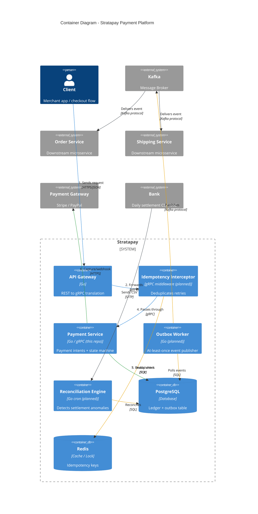
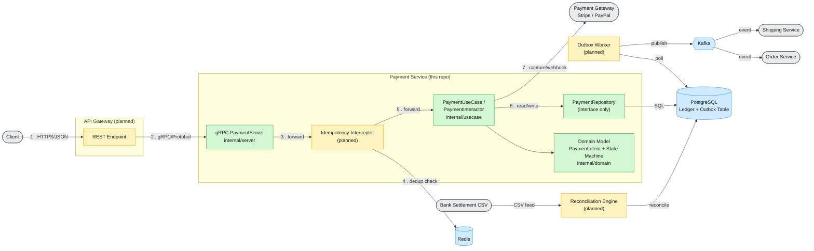

# Stratapay

Stratapay is a **payment processing microservices system** built for
absolute reliability. It uses an **API Gateway** pattern to translate
public-facing REST traffic into internal gRPC calls, and is designed to
solve three hard distributed-systems problems head-on: **network
partitions**, **race conditions**, and **cross-service state
synchronization**.

> This repository currently implements the core payment intent domain,
> use case, and gRPC service. The sections below describe the full
> target architecture; components not yet implemented are marked
> "(planned)" in the diagram.

## Tech Stack

| Category                    | Technology                                          |
|------------------------------|------------------------------------------------------|
| Core language & framework   | Go, gRPC, Protocol Buffers (Protobuf)                |
| Storage & caching           | PostgreSQL (ACID ledger), Redis (distributed lock & idempotency cache) |
| Message broker              | Kafka (async event-driven communication)             |
| Infrastructure & testing    | Docker, k6 (stress testing)                          |

## Core Concepts & Problems Solved

### 1. High-performance contracts with gRPC & Protobuf

- **Schema-first design**: `.proto` files are the single source of truth,
  used to auto-generate Go structs and service stubs (a compile-time
  contract between services).
- **HTTP/2 multiplexing** with binary Protobuf payloads reduces CPU
  overhead from JSON parsing and minimizes internal network bandwidth.
- **gRPC deadlines & context propagation**: a timed-out request from the
  API Gateway automatically cancels downstream SQL queries and other
  in-flight work, avoiding wasted resources.

### 2. Idempotency layer

- A custom gRPC **interceptor (middleware)** backed by Redis blocks
  duplicate requests caused by double-clicks or network-retry logic.
- Strict request-state handling:
  - Returns `409 Conflict` if an identical request is still `PROCESSING`.
  - Returns the cached result immediately if the request already
    `COMPLETED`, without re-calling the third-party payment gateway.

### 3. Strict state machine

- The lifecycle of a `PaymentIntent` is governed by an explicit state
  machine: `INITIATED → PENDING → CAPTURED → REFUNDED`.
- Out-of-order webhooks from payment gateways (Stripe/PayPal) are
  rejected outright. For example, if the current state is already
  `CAPTURED`, a late `PENDING` webhook is refused and logged as a
  warning — it can never move the state backwards.

### 4. Transactional Outbox pattern

- Eliminates data loss or inconsistency between PostgreSQL and the
  message broker when notifying other services (Order, Shipping, etc.)
  of a payment state change.
- A single ACID database transaction both updates the `payments` table
  and writes the corresponding event into an `outbox_table`.
- An independent Go worker polls the outbox table and publishes events
  to Kafka with **at-least-once delivery** guarantees (partitioned by
  `payment_id`/`order_id` to preserve per-entity ordering, and retained
  so events can be replayed for audit or reconciliation).

### 5. Reconciliation engine

- A background cron job streams large CSV files (simulating a bank's
  daily settlement report) without loading them entirely into memory.
- It automatically cross-checks transaction IDs between the partner's
  data and the internal database, flags anomalies (financial
  discrepancies) early, and can auto-update statuses or raise alerts to
  the monitoring system.

## System Invariants

These rules must hold unconditionally, with no exceptions:

1. A given payment can **never be captured more than once**.
2. Duplicate events or webhooks from a partner must **never** produce a
   side effect that changes a balance.
3. Every state transition **must** go through the configured state
   machine — invalid transitions are always rejected.

## Architecture Diagram (C4 Container View)



Numbers `1-6` trace the main synchronous request path (client → gateway →
interceptor → payment service → database/PSP); the remaining unlabeled
arrows are the async fan-out (outbox → broker → downstream services) and
the reconciliation batch job.

### Fallback Diagram (GitHub-renderable)

GitHub's built-in Markdown viewer does not yet render `C4Container`
diagrams, so here is the same architecture as a standard `flowchart`.
Edge labels are kept short and placed on dedicated label nodes so they
stay readable even on GitHub's default renderer.



**Legend:** 🟩 implemented in this repo · 🟨 planned · 🟦 data store / broker · ⬜ external system

## Project Structure

```
.
├── proto/payment/v1/       # Protobuf definitions and generated gRPC code
├── internal/domain/        # Core types and interfaces (PaymentIntent, PaymentUseCase, PaymentRepository)
├── internal/usecase/       # Business logic (PaymentInteractor)
├── internal/server/        # gRPC server implementation (PaymentServer)
└── Makefile                # Common dev commands
```

## Requirements

- Go 1.26+
- `protoc` (only needed if regenerating protobuf code)

## Getting Started

Clone the repository and download dependencies:

```bash
git clone https://github.com/johncegom/stratapay.git
cd stratapay
go mod download
```

## Usage

### Run tests

```bash
make test
```

### Regenerate protobuf/gRPC code

After editing `proto/payment/v1/payment.proto`, regenerate the Go bindings:

```bash
make gen-proto
```

## API Overview

### `PaymentService.CreatePaymentIntent`

Creates a new payment intent, or returns the existing one if the same
`idempotency_key` was already used.

**Request** (`CreatePaymentIntentRequest`)

| Field             | Type   | Description                          |
|-------------------|--------|---------------------------------------|
| `idempotency_key` | string | Required. Unique key for the request  |
| `amount_in_cents` | int64  | Required. Must be greater than zero   |
| `currency`        | string | Currency code (e.g. `USD`)            |
| `order_id`        | string | Associated order identifier           |

**Response** (`CreatePaymentIntentResponse`)

| Field              | Type          | Description                        |
|--------------------|---------------|-------------------------------------|
| `payment_id`       | string        | Generated payment intent ID (UUID)  |
| `state`            | `PaymentState`| Current state of the payment intent |
| `idempotency_key`  | string        | Echoes back the idempotency key     |

**Payment states:** `INITIATED`, `PENDING`, `CAPTURED`, `FAILED` (the
proto also reserves `REFUNDED` for the target state machine described
above)

## Code Layout Notes

The codebase follows a simple clean-architecture pattern:

- **`domain`** defines the `PaymentIntent` model plus the `PaymentUseCase`
  and `PaymentRepository` interfaces.
- **`usecase`** implements `PaymentUseCase` via `PaymentInteractor`, which
  contains the idempotency logic and depends only on the
  `PaymentRepository` interface (not a concrete database).
- **`server`** implements the gRPC `PaymentService`, validating requests
  and delegating to `PaymentUseCase`.

This keeps business logic independent of both the transport layer (gRPC)
and the persistence layer. A concrete `PaymentRepository` implementation
(e.g. backed by PostgreSQL) has not been added yet.
